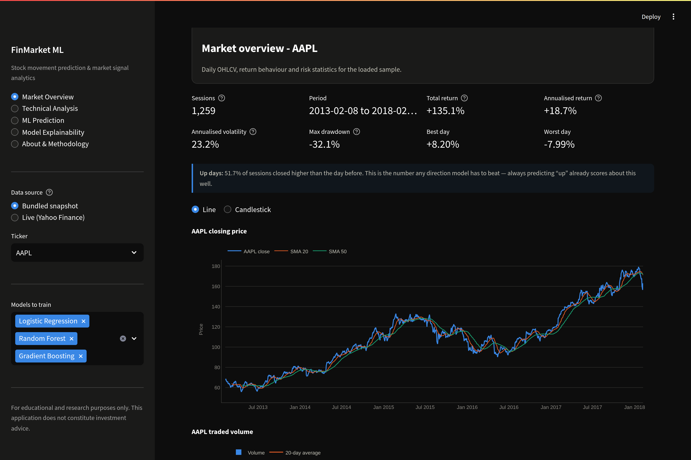
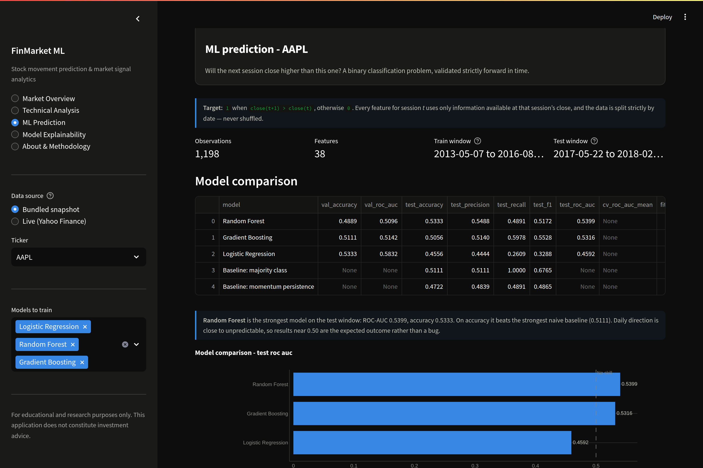
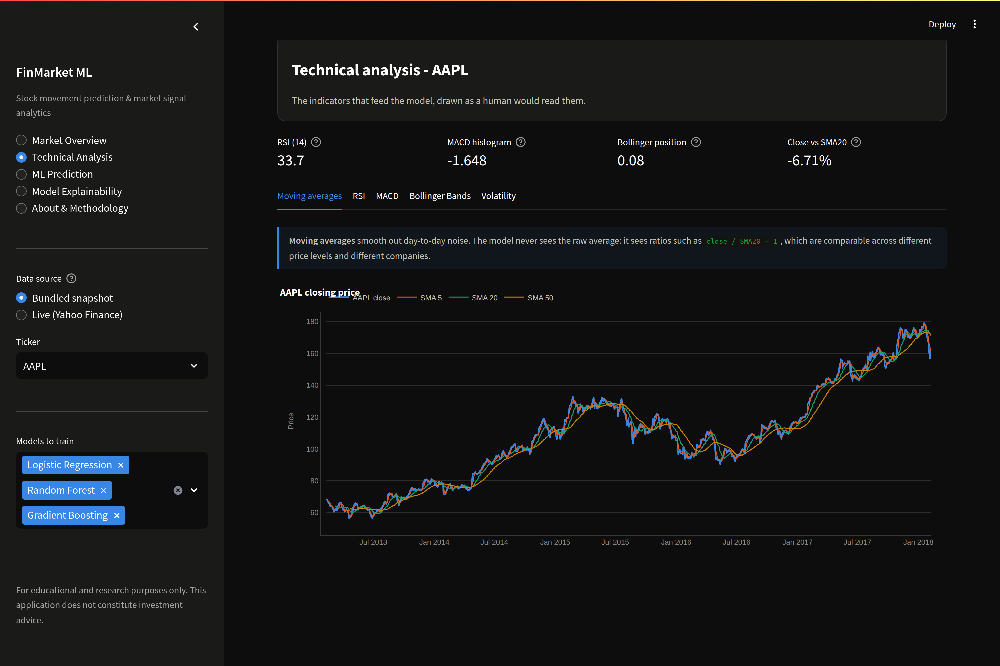

# FinMarket ML

**Stock movement prediction and market signal analytics** — an end-to-end machine
learning pipeline that engineers 38 momentum, volatility, technical and
market-context features from daily OHLCV data and classifies whether a stock
will close higher on the next trading session, validated strictly forward in
time.

> For educational and research purposes only. This application does not
> constitute investment advice.

---

## The problem, and why direction rather than price

Predicting an exact future price looks impressive and measures almost nothing.
A regression model that predicts "tomorrow's close ≈ today's close" achieves a
very low error and carries no information: the naive persistence forecast is
already close to optimal in mean-squared-error terms, so a low RMSE tells you
nothing about whether the model knows anything.

This project asks a question with a checkable answer instead:

```
target(t) = 1  if  close(t+1) > close(t)
target(t) = 0  otherwise
```

Framed as binary classification, the result can be compared directly against
benchmarks that are hard to beat and impossible to fudge — always predicting the
majority direction, and predicting that tomorrow repeats today.

---

## Headline results

All numbers below are produced by `python scripts/run_experiment.py` on the
bundled data snapshot and are reproduced in
[`reports/experiment_report.md`](reports/experiment_report.md) and
[`reports/experiment_results.json`](reports/experiment_results.json).

**Dataset:** 46,436 ticker-sessions · 39 S&P 500 equities · 38 engineered
features · 2013-05-07 to 2018-02-06
**Split:** train 2013-05-07 → 2016-08-31 (32,396 rows) · validation 2016-09-01 →
2017-05-19 (7,020) · test 2017-05-22 → 2018-02-06 (7,020)

### Pooled cross-sectional model (test window)

| Model | Accuracy | Precision | Recall | F1 | ROC-AUC |
|---|---|---|---|---|---|
| **Gradient Boosting** | 0.4990 | 0.5706 | 0.2998 | **0.3931** | **0.5230** |
| XGBoost | 0.4969 | 0.5627 | 0.3153 | 0.4042 | 0.5222 |
| Random Forest | 0.4781 | 0.5535 | 0.1837 | 0.2759 | 0.5155 |
| Logistic Regression | 0.4774 | 0.5580 | 0.1645 | 0.2541 | 0.5022 |
| *Baseline: majority class* | *0.5412* | *0.5412* | *1.0000* | *0.7023* | *n/a* |
| *Baseline: momentum persistence* | *0.4981* | *0.5424* | *0.5327* | *0.5369* | *n/a* |

### Per-ticker models (39 tickers modelled independently)

| Model | Median test ROC-AUC | Tickers above 0.50 | Median accuracy |
|---|---|---|---|
| Random Forest | 0.5228 | 61.5% | 0.4889 |
| Gradient Boosting | 0.5206 | 61.5% | 0.5056 |
| XGBoost | 0.5125 | 61.5% | 0.5056 |
| Support Vector Machine (RBF) | 0.5000 | 48.7% | 0.5290 |
| Logistic Regression | 0.4967 | 46.2% | 0.4778 |

Median majority-class baseline accuracy across tickers: **0.5333**.

### Does ML beat the baseline?

**Partly, and the honest answer is worth more than a flattering one.**

- On **ROC-AUC** — the threshold-free measure of whether the model *ranks* up-days
  above down-days — the tree ensembles land at **0.5230** pooled and a **0.5228**
  median per ticker, above the 0.50 no-skill line. The features carry a small
  amount of genuine ranking information.
- On **accuracy**, no model beats the majority-class baseline of **0.5412**. Because
  the classifiers are fitted with balanced class weights they predict "up" on only
  28% of test sessions, trading raw accuracy for a more informative ranking. A
  constant "up" forecast remains the stronger accuracy rule.

An edge of roughly two ROC-AUC points is real but small, unstable across periods,
and comfortably inside the range that transaction costs would erase. That is the
expected result for daily direction on liquid large-cap equities, and it is
reported rather than tuned away.

### What actually drives the predictions

Top features by native importance for the best pooled model:

| Rank | Feature | Importance |
|---|---|---|
| 1 | `market_volatility_20d` | 0.3043 |
| 2 | `market_return` | 0.2483 |
| 3 | `market_return_5d` | 0.2247 |
| 4 | `month` | 0.0565 |
| 5 | `day_of_week` | 0.0228 |
| 6 | `intraday_return` | 0.0172 |
| 7 | `overnight_return` | 0.0166 |
| 8 | `volume_trend_5d` | 0.0131 |
| 9 | `relative_volume` | 0.0092 |
| 10 | `return_10d` | 0.0085 |

**Interpretation.** The three broad-market context features absorb 78% of total
importance. Whatever weak signal exists in next-day direction is a *market-state*
effect — how volatile and which way the whole market has been moving — rather than
anything specific to a company's own RSI or MACD. Single-stock technical
indicators, the features retail analysis leans on hardest, rank near the bottom.

---

## Screenshots

| Market overview | ML prediction |
|---|---|
|  |  |



---

## Architecture

```
                    ┌──────────────────────────┐
   yfinance  ──────▶│      Data layer          │
   (live)           │  loaders · validation    │
                    │  snapshot fallback       │
   bundled   ──────▶└────────────┬─────────────┘
   snapshot                      │
                                 ▼
                    ┌──────────────────────────┐
                    │   Feature engineering    │
                    │  price · momentum · MA   │
                    │  RSI/MACD/Bollinger      │
                    │  volatility · volume     │
                    │  market context          │
                    └────────────┬─────────────┘
                                 │  38 causal features + t+1 label
                                 ▼
                    ┌──────────────────────────┐
                    │  Chronological splitting │
                    │  70 / 15 / 15 by date    │
                    │  + TimeSeriesSplit CV    │
                    └────────────┬─────────────┘
                                 ▼
                    ┌──────────────────────────┐
                    │      Model zoo           │
                    │  LogReg · RF · GBM       │
                    │  XGBoost · SVM           │
                    └────────────┬─────────────┘
                                 ▼
              ┌──────────────────┴──────────────────┐
              ▼                                     ▼
   ┌────────────────────┐              ┌────────────────────────┐
   │    Evaluation      │              │    Explainability      │
   │ acc/P/R/F1/ROC-AUC │              │ coefficients · gain    │
   │ vs 2 baselines     │              │ permutation · SHAP     │
   └─────────┬──────────┘              └───────────┬────────────┘
             └───────────────┬───────────────────-─┘
                             ▼
                  ┌────────────────────┐
                  │  Streamlit app     │
                  │  5 pages · Plotly  │
                  └────────────────────┘
```

---

## Data

**Bundled snapshot (default).** A fixed extract of real daily OHLCV committed to
`data/snapshot/`, so every published number is reproducible offline with no API
key and no network:

- 39 S&P 500 equities plus `MKT_EW`, an equal-weighted index constructed from the
  474 constituents with complete history
- 50,074 rows, 1,259 sessions per equity, 2013-02-08 to 2018-02-07
- Source: S&P 500 daily OHLCV published by Cam Nugent
  ([CNuge/kaggle-code](https://github.com/CNuge/kaggle-code))
- Prices are split-adjusted; the source publishes no separate dividend-adjusted
  series, so `adj_close` mirrors `close` and total-return figures understate what
  a holder would have earned

Rebuild it with:

```bash
curl -L -o data/raw/individual_stocks_5yr.zip \
  https://raw.githubusercontent.com/CNuge/kaggle-code/master/stock_data/individual_stocks_5yr.zip
python scripts/build_snapshot.py --archive data/raw/individual_stocks_5yr.zip
```

**Live mode.** Selecting *Live (Yahoo Finance)* in the sidebar downloads fresh
daily OHLCV through `yfinance` for any resolvable symbol — US equities, `^GSPC`,
`^IXIC`, `^NSEI`, `RELIANCE.NS`, `TCS.NS` and so on. If a download fails for any
reason the app falls back to the snapshot and says so, so no page ever
dead-ends.

---

## Features

38 features, all computable at the close of session *t*:

| Group | Features |
|---|---|
| **Price** | `daily_return`, `log_return`, `overnight_return`, `intraday_return`, `high_low_range`, `close_to_high` |
| **Momentum** | `return_3d`, `return_5d`, `return_10d`, `return_20d` |
| **Moving averages** | `close_to_sma{5,10,20,50}`, `close_to_ema{10,20}`, `sma5_to_sma20`, `sma20_to_sma50` |
| **Technical** | `rsi_14`, `macd`, `macd_signal`, `macd_hist`, `bb_position`, `bb_width`, `atr_14_norm` |
| **Volatility** | `volatility_{5,10,20}d`, `vol_ratio_5_20` |
| **Volume** | `volume_change`, `relative_volume`, `volume_trend_5d` |
| **Calendar** | `day_of_week`, `month` |
| **Market context** | `market_return`, `market_return_5d`, `market_volatility_20d`, `excess_return` |

Moving averages and MACD enter as **ratios**, never raw levels. A raw 50-day
average is non-stationary and ticker-specific; `close / SMA50 − 1` is scale-free
and comparable across companies and across time, which is what makes a single
pooled model across 39 tickers coherent.

---

## Leakage control

The three rules that make the evaluation trustworthy, each enforced in code and
covered by tests in [`tests/test_leakage.py`](tests/test_leakage.py):

1. **Causal features only.** Every indicator uses a trailing window ending at
   session *t*. The test-suite proves this by recomputing each indicator on a
   truncated history and asserting that no earlier value changes, and separately
   by perturbing the final close and asserting that no earlier feature row moves.
2. **Chronological splitting.** Train, validation and test blocks are contiguous
   and strictly ordered. `assert_chronological` fails the run if a later block
   ever begins before an earlier one ends, and passing a shuffled frame to
   `chronological_split` raises. For the pooled dataset the cut is made on
   **calendar dates**, not row positions, so one session can never straddle two
   partitions.
3. **Scaling inside the pipeline.** `StandardScaler` sits inside the scikit-learn
   `Pipeline`, so fold statistics never see held-out data.

A fourth check runs as a tripwire: no single feature may correlate above 0.30
with the target. A near-perfect single-feature correlation is the signature of
leakage, and the suite fails if one appears.

---

## Model evaluation

Models are fitted on the training window, inspected on validation, then refitted
on train + validation before a **single** evaluation on the test window. Expanding-window
`TimeSeriesSplit` cross-validation is available for model selection.

Two baselines are computed on the same test window:

- **Majority class** — always predict the direction that dominated training.
  Equities rise on slightly more than half of sessions, so this scores above 50%
  before any modelling.
- **Momentum persistence** — predict that tomorrow repeats today's direction.

Per-ticker results are reported **per model**, not as "the best model for each
ticker". Choosing the winner on the test window is selection on the test set and
inflates the number: it would have given a median ROC-AUC of 0.5486 instead of
0.5228. That figure appears in the JSON report labelled as biased, and is not
quoted as a result.

---

## Research signal

The ML analytics is the centre of this project; the signal below is a small
interpretive layer on top of it.

Predicted probabilities map to a three-state label — Bullish above 0.55, Bearish
below 0.45, Neutral in between. The app also runs an illustrative study of what
would have happened holding a long position only on Bullish sessions, charging
5 basis points on every change of position.

**This is not a trading recommendation.** The study ignores slippage, liquidity,
borrow costs, taxes, position sizing and survivorship, covers a single test
window, and one realised path is a sample of size one. On the pooled test window
it produced +4.15% against +21.09% for buy-and-hold while in the market 9.4% of
sessions — that is, the rule mostly sat in cash during a strong up-market.

---

## Running it

```bash
git clone https://github.com/<your-username>/finmarket-ml.git
cd finmarket-ml

python -m venv .venv && source .venv/bin/activate     # Windows: .venv\Scripts\activate
pip install -r requirements.txt

streamlit run app.py
```

The app opens at `http://localhost:8501` and works immediately against the
bundled snapshot — no API key, no network access required.

Reproduce the published metrics:

```bash
python scripts/run_experiment.py                 # full run: panel + 39 per-ticker models
python scripts/run_experiment.py --tickers AAPL MSFT --skip-per-ticker   # quick run
```

Run the tests:

```bash
pip install -r requirements-dev.txt
pytest                                            # 79 tests
```

### Deploying to Streamlit Community Cloud

1. Push this repository to GitHub.
2. At [share.streamlit.io](https://share.streamlit.io) choose **New app**, select
   the repository and branch, and set the main file to `app.py`.
3. Deploy. No secrets or environment variables are needed — the bundled snapshot
   ships in the repository and the default demo requires no network access.

---

## Project structure

```
finmarket-ml/
├── app.py                          # Streamlit application (5 pages)
├── config/settings.py              # every tunable constant
├── data/
│   ├── raw/                        # source archives (gitignored)
│   └── snapshot/                   # committed reproducible extract
├── src/
│   ├── data/       loaders.py · validation.py
│   ├── features/   technical.py · builder.py · panel.py
│   ├── models/     splits.py · registry.py · train.py
│   ├── evaluation/ metrics.py · explainability.py · signal.py
│   ├── visualization/ theme.py · charts.py
│   └── utils/      logging_utils.py · stats.py
├── scripts/
│   ├── build_snapshot.py           # rebuild the data extract
│   └── run_experiment.py           # produce every published number
├── models/                         # fitted artefacts (gitignored)
├── reports/                        # generated metrics, JSON + Markdown
├── tests/                          # 79 tests
└── resume_bullets.md
```

---

## Limitations

- Daily direction on liquid large-cap equities is close to a coin flip. The edge
  measured here (≈0.02 ROC-AUC) is small, unstable across periods, and within the
  range transaction costs would erase.
- The snapshot covers 2013–2018, which was predominantly a rising market. Nothing
  here should be extrapolated to a different regime.
- Prices are split-adjusted but not dividend-adjusted.
- The universe is 39 large-cap S&P 500 names that survived to 2018, so it carries
  survivorship bias by construction.
- No fundamental, macroeconomic or news data is used. The companion project,
  [MarketSense AI](https://github.com/<your-username>/marketsense-ai), covers the
  news and sentiment dimension.

## Future work

- Weekly and multi-day horizons, where the signal-to-noise ratio is more forgiving
  than daily
- Volatility-regime conditioning, given how dominant the market-state features are
- Walk-forward retraining with an expanding window instead of one fixed split
- Sector and cross-sectional ranking rather than per-ticker binary classification
- Probability calibration (isotonic or Platt) before any threshold-based signal

## Tech stack

Python 3.11 · pandas · NumPy · scikit-learn · XGBoost · Plotly · Streamlit ·
yfinance · joblib · SHAP · pytest

## Licence

MIT — see [LICENSE](LICENSE).

---

**Disclaimer.** For educational and research purposes only. This application does
not constitute investment advice. Past performance does not indicate future
results, and nothing in this repository should be used to make investment
decisions.
